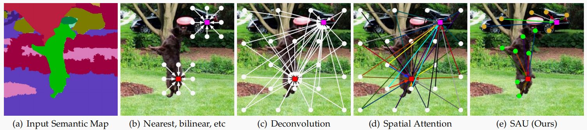

# Jittor 草图生成风景比赛 LGGAN+SAU
> 成员：梁磊、何旭峰、俞贤康（华东理工大学）

> 指导教师：陈志华（华东理工大学）、盛斌（上海交通大学）

## 定量结果

| 缩放方法 | request_id | mask accuary | 美学评分 | FID | 总分 | 排名 |
| :----: | :----: | :----: | :----: | :----: | :----: | :----: |
| BICUBIC | 2022071413284143191797 | 0.9028 | 4.9005 | 44.6153 | 0.4712 | 15 |
| RCAN | 2022071511114526252977	 | 0.9037 | 4.9004 | 42.7708 | 0.48 | 15 |
## 定性结果
> *左：草图，右：风景图像*


## 简介
本项目包含了第二届计图挑战赛 (赛题一-草图生成风景) 的代码实现。本项目使用Jittor复现了 [*LGGAN*](https://arxiv.org/abs/1912.12215) 和 [*LGGAN++*](https://arxiv.org/abs/2203.00047v1)中的SAU模块。在上述LGGAN和SAU模块的基础上吗，本项目实现了草图生成风景方法，LGGAN包含全局、局部两个分支，分别从草图（分割图）生成风景图像。通过基于注意力机制的权重学习模块，两个分支输出的风景图像被融合为最终的风景图像。

在整个生成过程中，SAU作为语义感知的上采样模块，能在计算上采样结果中特定像素值时，考虑了语义上属于相同类别的像素点对该像素值的贡献。相较于插值方法、pixel shuffle、转置卷积等方法，SAU充分利用了像素邻域的语义信息，提高上采样的精度；另一方面，相较于空间注意力机制，SAU不进行高复杂度的像素间相关性计算，不会捕获过度冗余的信息，而是仅处理相同类别像素点间蕴含的语义信息，上采样效率更高，计算成本更低。

由于本模型训练时会占用大量的计算资源 (24G_BATCH_SIZE=2)，本项目在训练及测试时，仅生成分辨率为(192\*256)的图片，后续通过BICUBIC插值或超分辨率重建，将图像缩放到目标尺寸(384\*512)。
本项目在超分辨率重建部分，复现了 [*RCAN*](https://arxiv.org/abs/1807.02758)。该模型提出了Residual in Residual(RIR)结构，其包含多个Residual Group(RG)，RG之间通过长程跳跃连接(LSC)连接。每个RG由Residual Channel Attention Block(RCAB)及短程跳跃连接(SSC)组成。跳跃连接及通道注意力的使用，能使网络专注于学习图像的高频信息，提升重建结果的准确度和视觉效果。


## 安装
#### 运行环境
**batch size** 设置为 **2** 的前提下 ，本项目可在 1 张 A5000 或 RTX3090 上运行，训练时间约为 3-4 天；训练时空余的存储空间最好在 **20G** 左右。
- ubuntu 18.04 LTS
- python即相关包的版本，详见[requirements.txt](./requirements.txt)

#### 安装依赖
执行以下命令安装 python 依赖
```
pip install -r requirements.txt
```

#### 预训练模型存放位置 目录结构
```bash
# checkpoint存放目录的结构
项目目录
--checkpoint            (风景图像生成checkpoint保存的目录)
----jittor              (训练数据)
------latest_net_G.pkl  (生成器checkpoint)
------latest_net_D.pkl  (判别器checkpoint)
..
..
..
--RCAN                  (【可选】超分辨率checkpoint保存的目录)
----best.pkl            (超分辨率checkpoint)
..
..
```
#### 风景图像生成 预训练模型下载地址
1）下载`netG、netD`的模型文件（包括latest_net_G.pkl及latest_net_D.pkl）
```bash
latest_net_G.pkl
链接：https://pan.baidu.com/s/1YEOBWii6iZUxcXOwgRwIHg?pwd=znss 
提取码：znss

latest_net_D.pkl
链接：https://pan.baidu.com/s/1Q1eDx2OQ6qw0LgQIWY4mbA?pwd=jxwz 
提取码：jxwz
```
2）将`latest_net_G.pkl、latest_net_D.pkl`移动到`checkpoints/jittor`目录下。
##### 【可选】超分辨率缩放 预训练模型下载地址
1）下载`RCAN-jittor`的模型文件
```bash
best.pkl
链接：https://pan.baidu.com/s/1GmBD-bN-SkWh7jrJn4LxXg?pwd=kui7 
提取码：kui7
```
2）将模型文件移动到 `RCAN/` 目录下

## 数据预处理
#### 目标数据集目录结构

```bash
LGGAN-jittor-fid-v2 (项目目录)
--datasets
----landscape       (数据集目录)
------train         (训练数据)
--------imgs
--------labels
------val
--------imgs
--------labels
------testA         (A榜测试数据)
--------labels
------testB         (B榜测试数据)
--------labels
```
*1) 为构建上述数据集目录结构。首先进入项目目录，执行下述命令，下载训练、测试集并解压*
```bash
# 假定数据集目录名为 landscape
cd datasets && mkdir landscape && cd landscape

# train
wget -O train.zip https://cloud.tsinghua.edu.cn/f/1d734cbb68b545d6bdf2/?dl=1
unzip -q train.zip

# testA
wget -O testA.zip https://cloud.tsinghua.edu.cn/f/70195945f21d4d6ebd94/?dl=1
unzip -q testA.zip -d testA
cd testA && mv val_A_labels_cleaned labels
cd ..

# testB
wget -O testB.zip https://cloud.tsinghua.edu.cn/f/980d8204f38e4dfebbc8/?dl=1
unzip -q testB.zip -d testB
cd testB && mv val_B-labels-clean labels
cd ..

# clean
rm *.zip
```

*2) 运行`split_dataset.ipynb`所有单元格，分割训练集和验证集*


## 训练
### 训练 风景图像生成模型
其训练分为了两个阶段：
- 阶段 1，按照`train.sh`中的命令运行，训练到第 **90** 个epoch结束
- 阶段 2，按照`train_second_stage.sh`中的命令运行，从第 **91** 个epoch开始，到第 **120** 个epoch结束。

### 【可选，分数只差 *0.1* 分】 训练 超分辨率缩放模型
其训练需要在原数据集上构造 *512\*384* 和 *256\*192* 两个版本的数据集
- 构造数据集：运行`construct_sr_dataset.ipynb`所有单元格构造训练RCAN的训练集和验证集。
- 训练：在bash下进入`RCAN`目录，运行`main.py`，并按要求指定`input_path`。训练 **100** epoch，选择`best.pkl`作为后续缩放使用的模型。


## 推理 (针对 B 榜测试数据)
```bash
# 【若超分辨率缩放不符合要求，请选择0.4712版本】

# 得分：0.4712
# 使用PIL.Image.resize缩放到384 * 512
python test.py --input_path ./datasets/landscape/testB/labels --output_path ./results


# 得分：0.48
# 使用jittor-RCAN超分辨率模型缩放到384 * 512
python test.py --input_path ./datasets/landscape/testB/labels --output_path ./results --use_sr
```


## 致谢
此项目基于论文 *Local Class-Specific and Global Image-Level Generative Adversarial Networks for Semantic-Guided Scene Generation*、*Local and Global GANs with Semantic-Aware Upsampling for Image Generation* 和 *Image Super-Resolution Using Very Deep Residual Channel Attention Networks* 实现，代码参考了 [lggan](https://github.com/Ha0Tang/LGGAN/tree/master/semantic_image_synthesis)、[JGAN](https://github.com/Jittor/JGAN/tree/master/competition/landscape_comp)、[RCAN](https://github.com/sanghyun-son/EDSR-PyTorch)。

